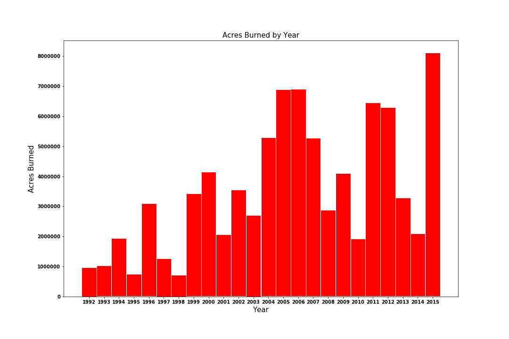
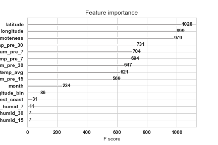

# Forest Fire Classification

**Authors**: [Justin Fernandez](mailto:justin_miguel_fernandez@gmail.com), [David Bruce](mailto:david.bruce14@gmail.com)

## Problem Overview
Wildfires are highly unpredictable natural disasters. They can be sparked by a variety of factors (human carelessness, arson, lightning, etc.), and spread and behave differently based on a myriad of different “ingredients.” All wildfires start small, but any one of these risk factors can change at a moment’s notice taking a fire from small and almost contained, to unwieldy and catastrophic. The effects of global climate change have only exacerbated the factors we know to be conducive to large wildfires, namely heat, drought, and high winds. While wildfires can occur almost anywhere at any time, there are certainly circumstances that make a wildfire more threatening.

## The Data
The [dataset](https://www.kaggle.com/capcloudcoder/us-wildfire-data-plus-other-attributes) was compiled on Kaggle from the Fort Collins, CO: Forest Service Research Data Archive about wildfires across the US (& PR) from 1992 - 2015, NOAA National Centers for Environmental Information, and supplemented from two other sources. **We wanted to create a highly interpretable, predictive model to help firefighters classify wildfires from less dangerous to more dangerous (small or large).** The National Wildfire Coordinating Group (NWCG) uses a retroactive [classification metric](https://www.nwcg.gov/term/glossary/size-class-of-fire#:~:text=As%20to%20size%20of%20wildfire,one%2Dfourth%20acre%20or%20less%3B&text=Class%20F%20%2D%201%2C000%20acres%20or,G%20%2D%205%2C000%20acres%20or%20more) of "A-G" where "A" is the smallest category burning anything under ¼ of an acre, and "G" being the largest class of fires burning a *minimum* of 5,000 acres. In order to make this a binary classification problem, we reduced these categories to small and large. As the data reflects, the vast majority of forest fires reported fall into the small category, and the other 15% are grouped into the large category, burning more than 100 acres.

The dataset includes features about what caused a fire, weather conditions leading up to the start of the fire, and geographical data about the type of environment most prevalent at the site of a fire. If firefighters are able to forecast a fire's potential to become "large" based on these factors and a few that we engineered from the data, they will be able to make faster prioritizations and real-time decisions about where and when to allocate their limited resources.

## Modeling
Working to produce a highly interpretable model limited our options to classifying with logistic regression and decision trees. With false positives and false negatives having equally deadly consequences we sought to minimize them both by working toward the best F1 score. By upsampling the positive minority class (large fires) and then performing recursive feature selection to limit ourselves only to the most important features, we were able to produce a highly accurate decision tree model after tuning the hyperparameters with a grid search cross validation. Our F1 score for our test set came out to 0.82 (balancing a precision score of 0.98 and a recall of 0.70). But perhaps most importantly, by visualizing the splits in our decision tree and focusing on feature importance with an XG Boost model, we were able to hone in on those factors that encourage wildfire spread. Below is a barchart explaining those features and their importance.

## Conclusions & Next Steps
-Remote fires are more likely to burn larger (presumably because they are identified late and arrived at after the fire has already grown substantially in size). Whenever and wherever possible, firefighters should operate with more resources and think about hiring and using more volunteers to help identify fires early.
	
-Areas where lightning storms are blowing through need to be highly monitored as lightning has the highest potential for starting a large wildfire of the known causes. The randomness and unpredictability of lightning make it a difficult cause to mitigate, but storms in drier areas should be tracked and monitored closely.
	
-Windiness significantly increases the risk of a fire getting out of hand and makes a fire more difficult to contain. Fires in the path of higher speed winds and changes in direction should be prioritized highly and dealt with quickly.

### Further Research
With more time we would have liked to gain access to more data from wildfires in the last 5 years, as well as realtime climatological data in order to make faster, more accurate predictions. With the recommendations we made, it would be great to locate where fire towers are placed across the US and where more could be strategically located.
 

### Navigation
- `final_notebook.ipynb`: Final notebook containing complete anlysis and modeling
- `EDA_FE_notebook.ipynb`: Exploratory data analysis and feature engineering
- `modeling.ipynb`: Classification modeling for prediction of fire size
- `data`: Folder containing data using in repository
- `images`: Folder containing images used in repository
